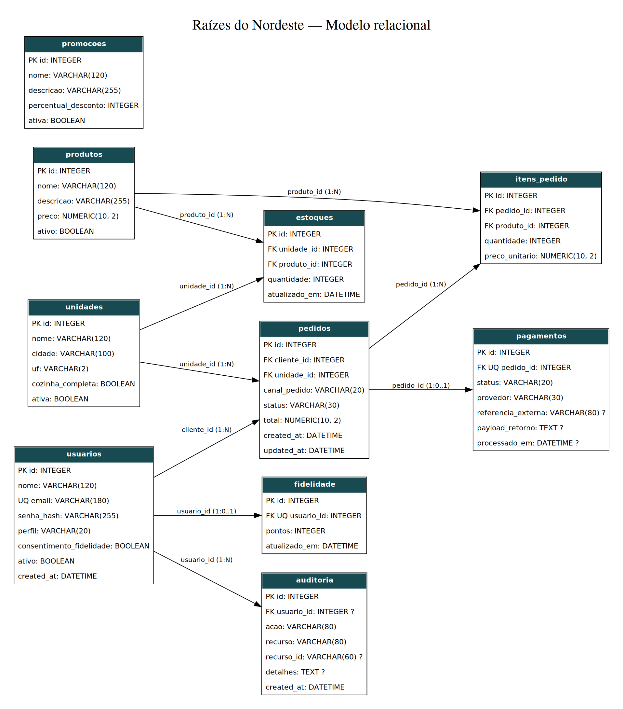

# Raízes do Nordeste - Back-end

Projeto da trilha Back-End para o estudo de caso **Rede Raízes do Nordeste**. A solução implementa um MVP executável com autenticação JWT (HS256), autorização por perfis, cardápio por unidade, estoque local, criação de pedidos multicanal, pagamento externo simulado, atualização de status, fidelização mediante consentimento e auditoria de ações sensíveis.

## Links de execução

- API local: http://127.0.0.1:8000
- Swagger UI: http://127.0.0.1:8000/docs
- OpenAPI JSON: http://127.0.0.1:8000/openapi.json
- Health check: http://127.0.0.1:8000/health
- Coleção Postman: `postman_collection.json`
- Ambiente Postman: `postman_environment.json`
- Repositório público: https://github.com/gopicolo/raizes-do-nordeste-backend

## Tecnologias

- Python 3.11+
- FastAPI
- SQLAlchemy 2
- Alembic
- SQLite
- Pytest + HTTPX/TestClient
- Swagger/OpenAPI (gerado pelo FastAPI)

## Arquitetura

O projeto separa responsabilidades em camadas:

- `app/domain`: enums e contratos do domínio.
- `app/application`: regras de negócio e serviços do fluxo crítico.
- `app/infrastructure`: banco, modelos ORM e segurança.
- `app/api`: dependências HTTP e routers/endpoints.

## Requisitos

1. Python 3.11 ou superior.
2. `pip` disponível.

## Instalação

No Windows (PowerShell):

```powershell
python -m venv .venv
.\.venv\Scripts\Activate.ps1
pip install -r requirements.txt
Copy-Item .env.example .env
```

No Linux/macOS:

```bash
python -m venv .venv
source .venv/bin/activate
pip install -r requirements.txt
cp .env.example .env
```

O arquivo `.env` da raiz é carregado automaticamente pela API, pelo Alembic e pelo seed. Variáveis já definidas no ambiente têm prioridade sobre o arquivo.

## Banco, migrations e seed

O banco padrão é SQLite, gravado em `raizes.db`.

```bash
alembic upgrade head
python -m scripts.seed
```

O seed cria duas unidades, quatro produtos, estoques, uma promoção e contas de demonstração:

| Perfil | E-mail | Senha |
|---|---|---|
| Cliente | `cliente@raizes.local` | `Cliente@123` |
| Atendente | `atendente@raizes.local` | `Atendente@123` |
| Gerente | `gerente@raizes.local` | `Gerente@123` |
| Cozinha | `cozinha@raizes.local` | `Cozinha@123` |
| Admin | `admin@raizes.local` | `Admin@123` |

Ao repetir o seed em um banco existente, a conta ATENDENTE ausente é adicionada sem repor estoques nem duplicar os demais registros.

As credenciais são somente para avaliação local. Em produção, devem ser substituídas.

## Iniciar a API

```bash
uvicorn app.main:app --reload
```

Acesse o Swagger em http://127.0.0.1:8000/docs.

## Fluxo crítico implementado

1. Cliente autentica em `POST /auth/login`.
2. Consulta cardápio por unidade em `GET /produtos?unidadeId=1`.
3. Cria pedido em `POST /pedidos`, informando obrigatoriamente `canalPedido` (`APP`, `TOTEM`, `BALCAO`, `PICKUP` ou `WEB`).
4. A API valida unidade, produtos e estoque, calcula total, reserva o estoque e cria pagamento `PENDENTE`.
5. `POST /pagamentos/{pedidoId}/processar` simula retorno `APROVADO` ou `RECUSADO`.
6. Se aprovado, o pedido muda para `PAGO` e pode gerar pontos quando houver consentimento. Se recusado, muda para `PAGAMENTO_RECUSADO` e o estoque é devolvido.
7. Cozinha/Gerência pode evoluir `PAGO -> EM_PREPARO -> PRONTO -> ENTREGUE`.
8. Ações sensíveis são registradas em auditoria.

## Cancelamento e resgate

Envie `PATCH /pedidos/{id}/status` com `{"status":"CANCELADO"}`. Cliente e atendente podem cancelar o próprio pedido enquanto ele aguarda pagamento. Cozinha, gerente e administrador também podem cancelar pedidos nos estados `PAGO` e `EM_PREPARO`. Pedidos prontos, entregues, recusados ou já cancelados não aceitam esse cancelamento.

O cancelamento devolve todos os itens ao estoque da unidade e registra a auditoria na mesma transação. Uma repetição não devolve estoque novamente, e um pedido cancelado não pode ser pago. Pagamento e cancelamento disputam a mesma transição de estado para evitar efeitos duplicados. O pagamento é um mock: não há cobrança nem estorno financeiro real.

Envie `POST /fidelidade/resgatar` com `{"pontos":2}`. O resgate exige consentimento e uma quantidade inteira positiva, debita apenas a conta autenticada e responde com `pontosResgatados` e `saldoPontos`. Saldo insuficiente retorna 409; ausência de consentimento, 403. O débito é atômico e auditado. Neste MVP, o resgate é uma operação de pontos, sem catálogo de recompensas ou conversão monetária. Os pontos são concedidos no pagamento aprovado; cancelamentos posteriores não estornam esses pontos.

## Padrão de erro

Todas as falhas HTTP retornam JSON padronizado:

```json
{
  "error": "ESTOQUE_INSUFICIENTE",
  "message": "Não há quantidade suficiente para um ou mais itens.",
  "details": [
    {"field": "itens[0].quantidade", "issue": "Disponível: 1"}
  ],
  "timestamp": "2026-10-01T03:00:00+00:00",
  "path": "/pedidos",
  "requestId": "uuid"
}
```

## Endpoints principais

| Método | Rota | Auth | Finalidade |
|---|---|---|---|
| POST | `/auth/cadastro` | Público | Cadastrar cliente |
| POST | `/auth/login` | Público | Autenticar e emitir token |
| GET | `/unidades` | Público | Listar unidades |
| GET | `/produtos?unidadeId=1` | Público | Cardápio/estoque por unidade |
| GET | `/promocoes` | Público | Listar campanhas ativas |
| POST | `/pedidos` | CLIENTE/ATENDENTE | Criar pedido multicanal |
| GET | `/pedidos` | JWT | Listar e filtrar por canal/status |
| GET | `/pedidos/{id}` | JWT | Consultar pedido |
| PATCH | `/pedidos/{id}/status` | Equipe; cliente/atendente no próprio pedido pendente | Evoluir status ou cancelar |
| POST | `/pagamentos/{id}/processar` | JWT autorizado | Processar pagamento mock |
| GET | `/estoque/unidades/{id}` | JWT | Consultar saldo da unidade |
| POST | `/estoque/movimentacoes` | GERENTE/ADMIN | Entrada/saída de estoque |
| GET | `/fidelidade/saldo` | JWT | Consultar pontos/consentimento |
| POST | `/fidelidade/resgatar` | JWT e consentimento | Resgatar pontos do próprio saldo |
| GET | `/auditoria` | GERENTE/ADMIN | Consultar trilha de auditoria |

## Testes automatizados

Executar:

```bash
PYTHONPATH=. pytest -q
```

No Windows PowerShell:

```powershell
$env:PYTHONPATH="."
pytest -q
```

A suíte contém **34 cenários** e cobre login, 401, 403, validação 422, criação de pedido, 404, estoque insuficiente 409, pagamento aprovado e recusado, fidelidade, auditoria, filtro por canal, cancelamento, concorrência, resgate de pontos, configuração do `.env` e seed idempotente.

## Postman

1. Importe `postman_collection.json`.
2. Importe `postman_environment.json` e selecione **Raizes do Nordeste - Local**.
3. Garanta que a API esteja rodando em `http://127.0.0.1:8000`.
4. Execute a coleção na ordem apresentada. Requisições auxiliares gravam tokens e IDs nas variáveis do ambiente.

A coleção inclui T16 (cancelamento com devolução única de estoque) e T17 (resgate com débito e proteção de saldo). A execução via Newman em 07/10/2026 concluiu 27 requisições e 32 verificações, sem falhas.

## Segurança e LGPD

- Senhas são armazenadas com PBKDF2-HMAC-SHA256 e salt aleatório; senha em texto puro não é persistida.
- Token assinado possui expiração configurável.
- Endpoints sensíveis usam autorização por perfil.
- A API evita retornar `senha_hash`.
- Fidelização só acumula pontos quando `consentimento_fidelidade` é verdadeiro.
- Auditoria registra ações sensíveis, usuário, recurso e horário.
- O projeto coleta apenas os dados pessoais mínimos para o MVP (nome e e-mail).
- Para produção: usar PostgreSQL, gerenciador de segredos, HTTPS, política formal de retenção/anonimização, rotação de chaves e observabilidade centralizada.

## Validação de carga e concorrência

O teste executado em 07/10/2026 inclui 1.400 consultas (1, 5 e 20 clientes concorrentes) e 60 tentativas de pedido para 40 unidades em estoque. O resultado final foi 40 respostas 201, 20 respostas 409 e saldo zero. As leituras tiveram 100% de respostas HTTP 200. Trata-se de carga sintética local, não de capacidade certificada para produção.

A reserva de estoque usa UPDATE atômico condicionado ao saldo, com rollback em caso de insuficiência. O teste automatizado adicional cobre itens repetidos no mesmo pedido.

Para repetir a validação em um banco **temporário**, sem modificar `raizes.db`:

```sh
python scripts/validar_projeto.py
```

Para incluir a coleção Postman, instale Node.js e as dependências do runner:

```sh
npm install
python scripts/validar_projeto.py --postman
```


## Diagrama entidade-relacionamento



O diagrama mostra as tabelas, chaves e relacionamentos implementados. `?` indica campo opcional; a combinação `(unidade_id, produto_id)` é única em `estoques`. A tabela `promocoes` é independente no MVP. As versões vetorial e editável estão em [der.svg](docs/diagramas/der.svg) e [der.dot](docs/diagramas/der.dot).

## Diagramas de casos de uso e classes

- [Casos de uso](docs/diagramas/casos_de_uso.png): inclui cancelamento, resgate de pontos e consulta de promoções.
- [Classes](docs/diagramas/classes.png): inclui `Promocao`, independente no MVP.

As versões SVG e as fontes DOT estão na mesma pasta.
